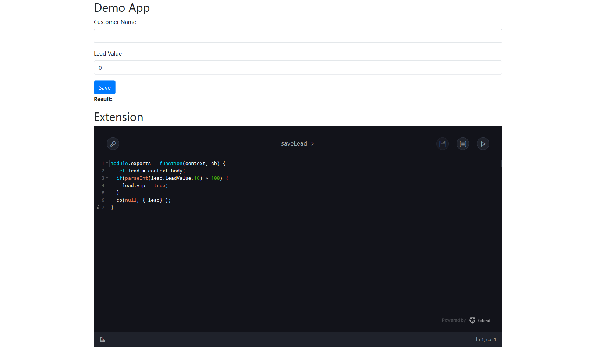
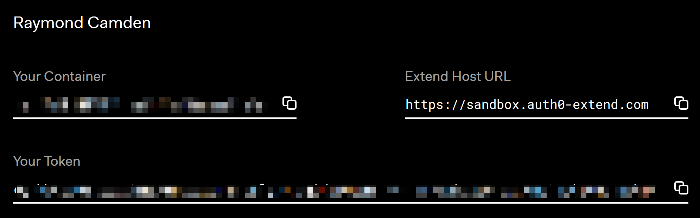
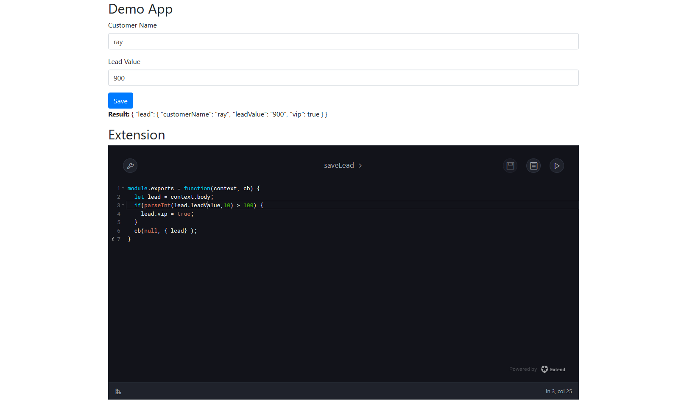

"One Pager" Demo
===

This is a simple, "one page" [Extend](https://goextend.io) demo. By that I don't mean it is actually one page of code, but one page of UI:

The top portion represents the 'traditional' business process that you would want to extend while the bottom portion is your Extend editor to allow for customization. Typically you would never have these on one page together, but it makes for a simple demo and here we are.

Setup
===

To use this demo, you need to create a `.env` file that looks like so:

	EXTEND_CONTAINER={{your container}}
	EXTEND_TOKEN={{your token}}

You can get these values by going to [goextend.io/try](https://goextend.io/try), logging in, and grabbing these values:

#### Starter Plan Users

If you are using the Extend Starter plan, your `.env` file will include one additional value:

	EXTEND_HOST={{your host}}

The Starter plan try page also refers to a "container prefix" which each container name must start with. As a Starter plan user, you have access to a limited amount of containers. In addition to the 5 containers for production, you also have one dedicated dev container which you can use for running this sample. Copy the the dev container value from the try page to the `EXTEND_CONTAINER` setting.  

Finally, the token provided to you is not appropriate for the container you will be using. You can use the [wt cli](https://goextend.io/docs/wt-cli) or Curl to create an appropriate key:

	curl -X POST https://starter.auth0-extend.com/api/tokens/issue -H "Authorization: Bearer MYTOKENHERE" -H "Content-Type: application/json" --data '{"ten":"CONTAINER"}'

In the sample command above, `MYTOKENHERE` is your token. `CONTAINER` is the dev container you used previously. Take the result of this call and use that in the `EXTEND_TOKEN` setting.

Running
===

Once you've saved the file, run `npm i` to install dependencies and then `npm start` to fire up the server.

By default the extension will have boilerplate code that won't actually work with the demo (you *can* customize the defaults the editor use and I may do so in a later update), but here is a quick sample of an extension that will do something interesting:

	'use strict';
	module.exports = function(context, cb) {
		let lead = context.body;
		if(parseInt(lead.leadValue,10) > 100) {
			lead.vip = true;
		}
		cb(null, { lead });	
	};

This demo will look at the data passed to the extension and see if the `leadValue` is high enough to consider it a `vip`. It then simply returns the value back. Be sure to hit the Save icon when making changes.

This is called by the back-end in app.js:

	app.post('/saveCustomer', (req, res) => {
		let data = req.body;
		console.log('i was sent: '+JSON.stringify(data));
		// call extension
		let options = {
			method:'POST',
			url:rxtendURL +'saveLead',
			headers:{'Authorization':`Bearer ${extendToken}`},
			json:req.body
		};

		request(options, function(error, response, body) {
			if(error) throw new Error(error);
			res.end(JSON.stringify(body));
		});

	});

Finally, you can see this running by simply playing with some values in the editor:

And that's it. Feel free to play with the logic (maybe leads named "Raymond" should have `nerd:true` or some such). 
